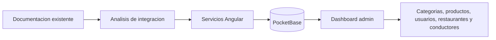

## Resumen del proyecto

Este sitio centraliza la documentacion del nuevo dashboard Angular y su integracion con Dale Pues.

La regla principal del proyecto es que el dashboard debe adaptarse al backend y al frontend existente: reutilizar colecciones, campos, reglas de negocio y patrones de servicios ya documentados. No se deben crear colecciones nuevas ni cambiar nombres de campos sin una migracion justificada en Dale Pues.

## Documentos principales

- [Analisis de integracion Dale Pues](./DALE_PUES_INTEGRATION_ANALYSIS.md)
- [Modulos del dashboard](./DALE_PUES_DASHBOARD_MODULES.md)

## Flujo de integracion



## Comandos

```bash
npm install
npm run docs:dev
npm run docs:build
npm run docs:preview
```
